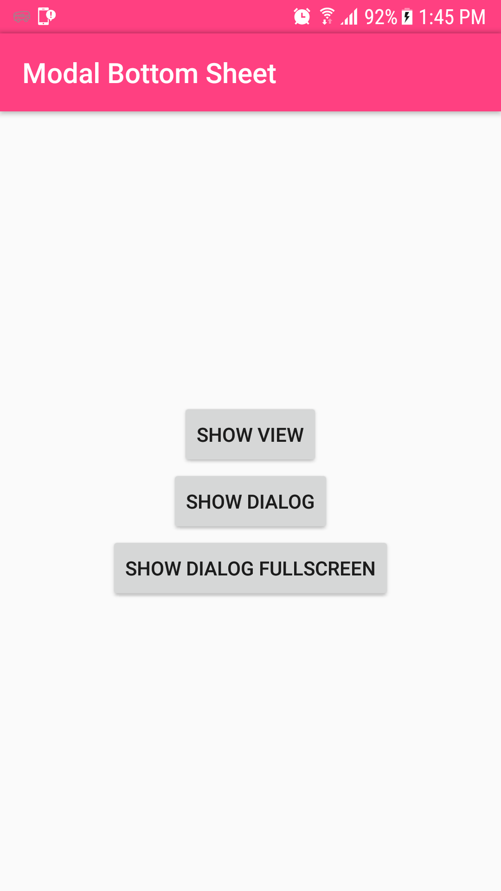
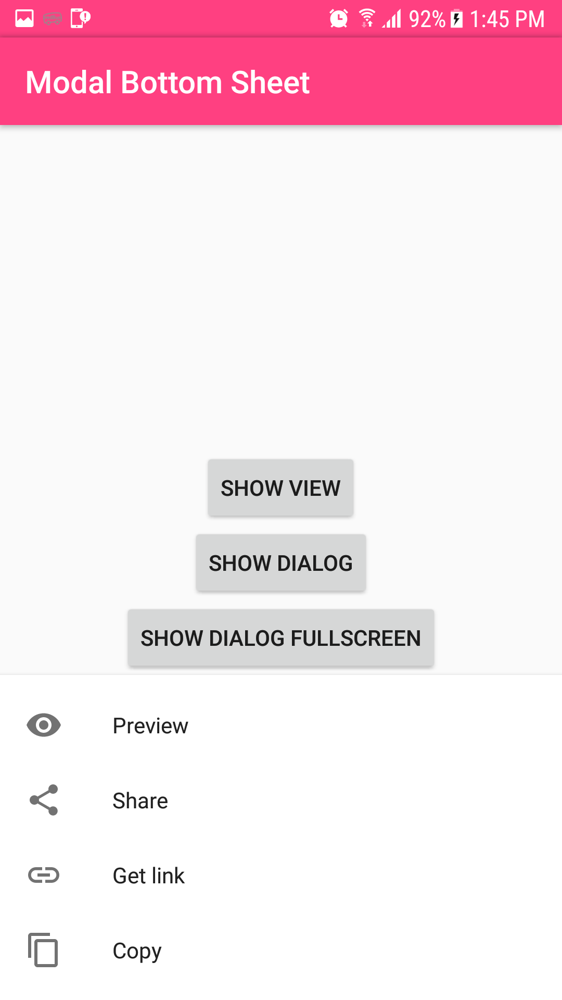
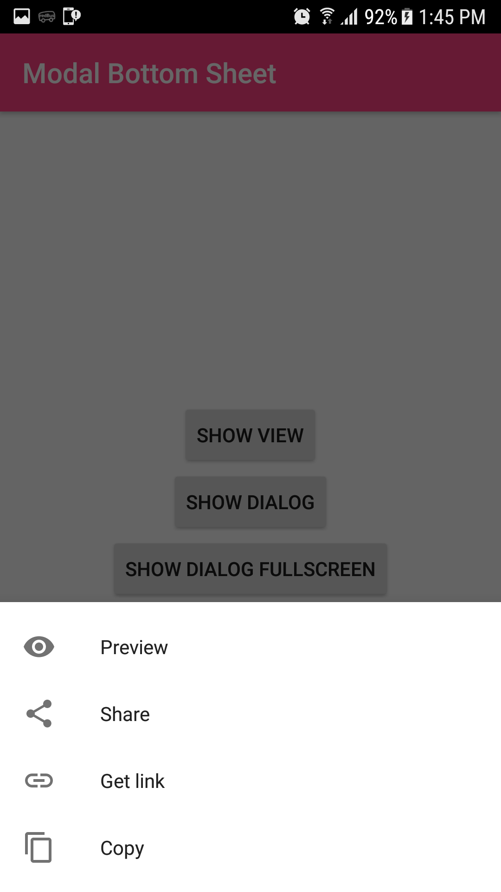
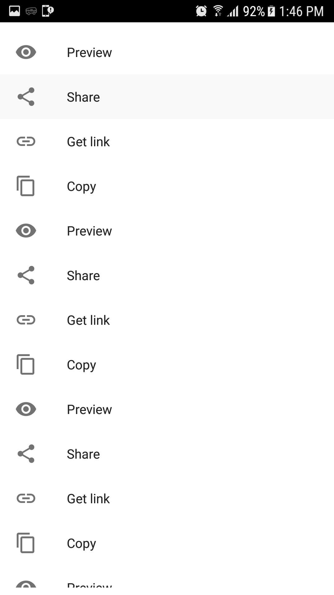

# BottomSheetExample
A sample project with the new BottomSheet classes from the android support library

For a simpler integration, consider using this: https://github.com/rubensousa/BottomSheetBuilder

## Modes included

- Simple view (A LinearLayout is used in this sample)
- BottomSheetDialog
- BottomSheetDialogFragment

## Simple view how-to

- Place a new view as a direct child of CoordinatorLayout (preferably as the last one, so it lays on top of all other views)
- Set it's behavior to:

        app:layout_behavior="@string/bottom_sheet_behavior"
        
## Screenshots
   

## Dependencies

    compile 'com.android.support:appcompat-v7:25.1.1'
    compile 'com.android.support:design:25.1.1'

